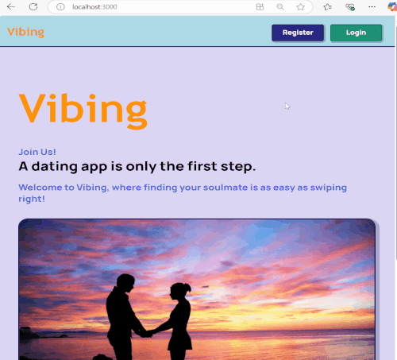

# Vibing

## Tools & Languages
* React
* NodeJS with Express
* Docker
* PostgreSQL
* pgAdmin
* Tailwind
* Socket.io for notifications and chat

## Features:

### Registration/Login

* User profile page
* Possibility to change username, firstname, lastname, email, location, etc.
* Upload pictures
* On your profile page, you can see the profiles you visited and the users who visited your profile
  
* Secure Authentication System: The website uses cookies to manage a secure login and authentication system.
* Two-Step Registration with Email Verification: New users register with a two-step process that includes email
  verification to confirm their identity.

### Profile

* User Profile Page: Each user has a dedicated profile page displaying personal information.
* Editable Profile Information: Users can update their profile details.
* Profile Picture Upload: Users have the ability to upload pictures to personalize their profiles.
* Profile Activity: Users can view profiles they have visited and they can see a list of visitors who have
  viewed their profile.

### Finding your possible lovers
* Match / Pass 
* Lots of sorting options
* Live notifications when someone looks at your profile or likes you or sends you a message
  

 ### It's a match!
 * If both liked each other you can start chatting

 ### How to use:
 * Rename 'vibing.env' file to '.env' => fill your info and API keys to that file
 * Type'docker-compose up' on the terminal and you are ready to start!
 
 

